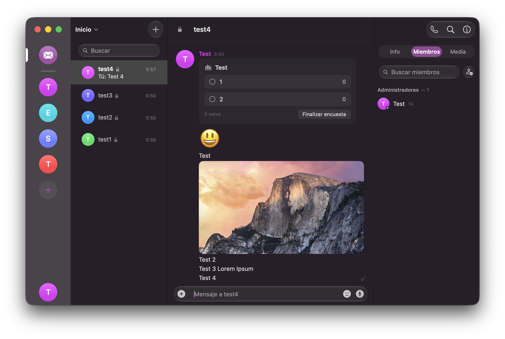
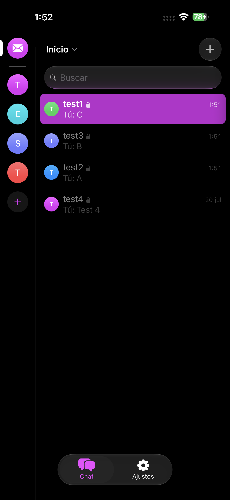
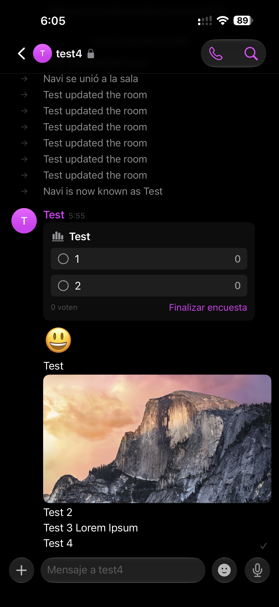

# Discourse for Matrix

Discourse is a native [Matrix](https://matrix.org) client for macOS and iOS,
written in SwiftUI on top of the [Matrix Rust SDK](https://github.com/matrix-org/matrix-rust-sdk).
The aim is simple: a chat app that opens straight into your conversations, feels
like it belongs on the platform it's running on, and mostly lets you forget
there's a protocol underneath.

It's one codebase for both platforms, but it doesn't settle for the lowest common
denominator. macOS gets a real multi-column layout, its own settings window, and
menu-bar commands. iOS gets a navigation stack, swipe actions, and a composer
that tracks the keyboard. Where the two genuinely differ, the code forks with
`#if os(...)` instead of pretending they're the same screen.

Under active development, and my daily driver. The iPhone and macOS layouts are
the focus right now; the iPad UI is still unfinished and doesn't yet make proper
use of the larger screen.

## Screenshots



| Room list | Conversation |
| :---: | :---: |
|  |  |

## How it works

The Rust SDK handles the hard parts (sync, crypto, the event store), and the
Swift side stays thin and UI-focused.

Sync runs over [sliding sync](https://github.com/matrix-org/matrix-spec-proposals/pull/3575),
so the client pulls only the rooms and events it's about to show instead of the
whole account, and everything lands in the SDK's local store. A cold launch
restores the last session and paints cached rooms before the network is even up.
The room list asks for a one-event timeline limit so sidebar previews and unread
counts fill in without subscribing to every room. The naive "subscribe to
everything" path produced roughly 12k-request syncs and, worse, stopped the
receipts and typing extensions from streaming.

The SDK's Swift bindings hand back FFI objects that aren't `Hashable` or
`Sendable`, so `Models/` maps every timeline item, room summary, and event into
plain value types up front. The UI only ever touches those, which keeps SwiftUI
diffing cheap and keeps FFI calls off the render path. Anything expensive per
message, like encryption shields or blurhash decoding, is computed lazily on row
appearance rather than during diffing.

Encryption follows the SDK's rules: cross-signing, server-side key backup, and
interactive device verification over emoji SAS. Per-message shields flag the
cases worth knowing about, like a message sent unencrypted in an encrypted room
or one from an unverified device, instead of hiding them.

## What's in it

- Spaces, rooms, and DMs in a draggable, reorderable rail.
- A full timeline: replies, threads, edits, redactions, reactions with custom
  emoji and image packs, read receipts, typing, and message search filtered by
  media type.
- Voice messages with waveforms, polls, stickers, inline images and video
  playback, and location sharing.
- Extended profiles (bio, pronouns, status, timezone, banner, social links),
  read and written with the keys the Commet and Element ecosystem uses, so they
  survive across clients.
- Voice and video calls via embedded [Element Call](https://github.com/element-hq/element-call).
- Presence, multiple accounts at once, and push notifications (APNs on iOS,
  decrypted in the background by a Notification Service Extension).
- Sign in by password, OAuth/OIDC, or SSO.
- Fully localized in English and Spanish.

## A note on calls

Calls embed Element Call as a widget in a `WKWebView`, driven by the SDK's widget
driver. The app hosts the web UI and relays Matrix events to and from the
homeserver. The WebRTC media itself flows client-to-SFU, not through the app.

If you self-host, the one thing to know is that MatrixRTC needs a LiveKit SFU
advertised in your homeserver's `.well-known/matrix/client` under
`org.matrix.msc4143.rtc_foci`. Without an advertised focus, a call started from
your account has no transport and dies with `MISSING_MATRIX_RTC_TRANSPORT`. Point
it at any LiveKit deployment:

```json
{
  "m.homeserver": { "base_url": "https://matrix.example.com" },
  "org.matrix.msc4143.rtc_foci": [
    { "type": "livekit", "livekit_service_url": "https://sfu.example.com" }
  ]
}
```

## Requirements

- Xcode 26. The deployment target is macOS 26 / iOS 26, and the UI uses the
  current SwiftUI, including the Liquid Glass materials.
- [XcodeGen](https://github.com/yonaskolb/XcodeGen).
- A homeserver with native sliding sync (Synapse 1.114+, or any server that
  implements it). Conduit-family servers such as Tuwunel work too, with the
  caveat that optional features like presence and the MSC4140 delayed events used
  by calls only work if the server actually implements them.

## Building

The Xcode project isn't committed; it's generated from `project.yml` with
XcodeGen. Generate it before opening:

```sh
git clone https://github.com/FulltimeFeline/Discourse.git
cd Discourse
xcodegen generate
open Discourse.xcodeproj
```

Build the `Discourse` scheme for macOS or `Discourse-iOS` for iOS. Swift Package
Manager resolves dependencies on the first build. To add a file or change a build
setting, edit `project.yml` and re-run `xcodegen generate`. The generated project
is disposable; editing it in Xcode gets overwritten on the next generate.

## Project structure

- `App/`: the entry point, the root phase machine (launch, restore, active,
  re-auth), and the window and settings scenes.
- `Core/`: the SDK service wrapper, session and keychain storage, media loading
  and caching, notifications, and presence.
- `Features/`: the room list, timeline and composer, calls, search, settings,
  and authentication, each kept self-contained.
- `Models/`: the plain value types and their mapping from the SDK's FFI.

## License

Released under the [MIT License](LICENSE). The source is open; the App Store
build is a paid convenience for people who'd rather not compile it themselves.

## Acknowledgements

Built and maintained by [FulltimeFeline](https://github.com/FulltimeFeline).

It stands on the [Matrix Rust SDK](https://github.com/matrix-org/matrix-rust-sdk),
packaged for Swift as
[matrix-rust-components-swift](https://github.com/matrix-org/matrix-rust-components-swift).
Session restore and the room list took cues from
[Element X iOS](https://github.com/element-hq/element-x-ios), a useful reference
for driving the SDK. Calls embed
[Element Call](https://github.com/element-hq/element-call). The extended-profile
field keys follow the Commet and Element conventions so profiles read correctly
across the ecosystem.
